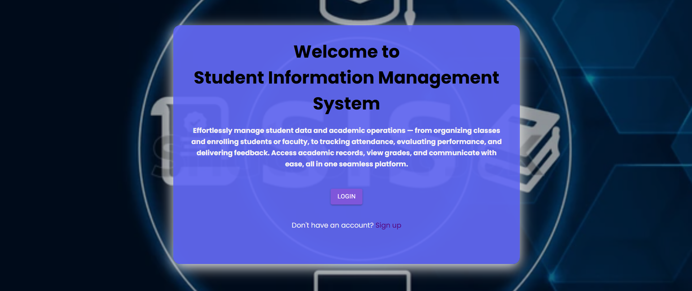
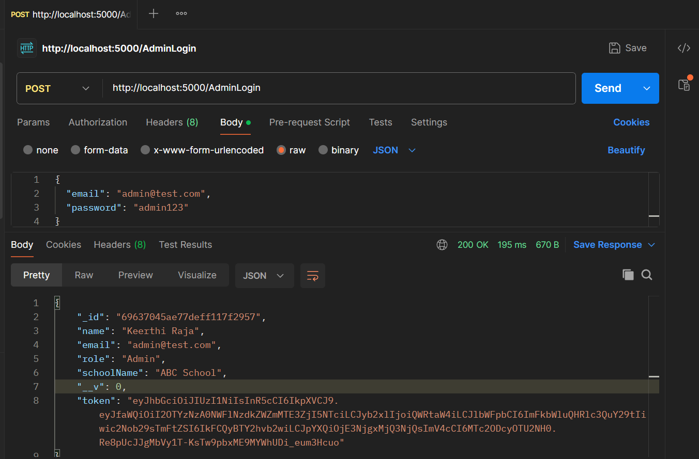
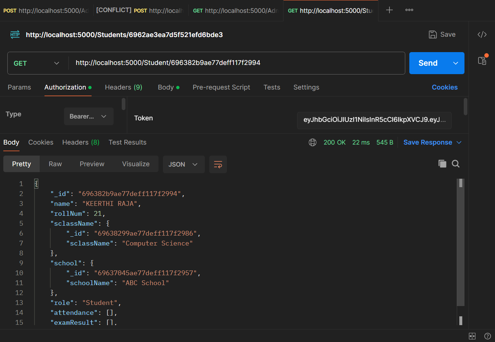
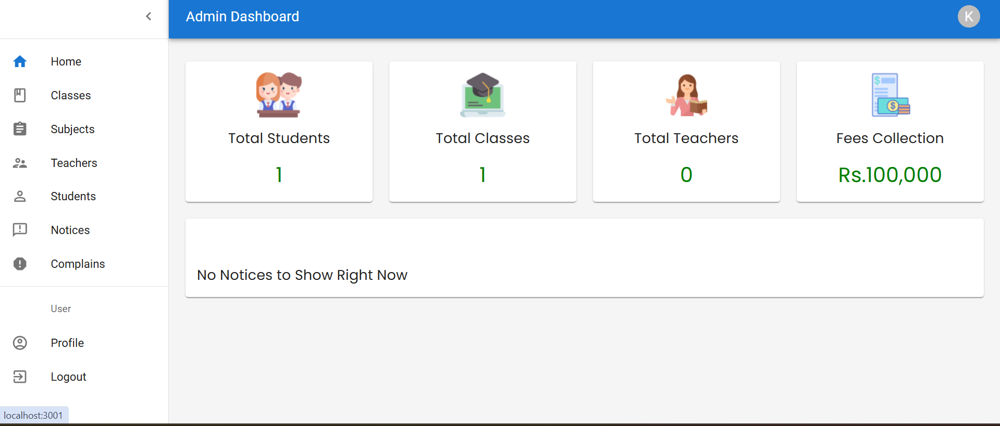
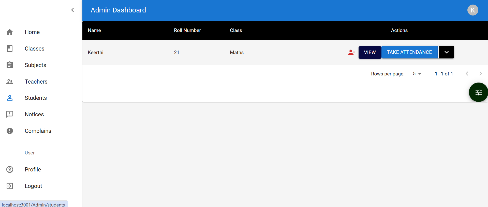
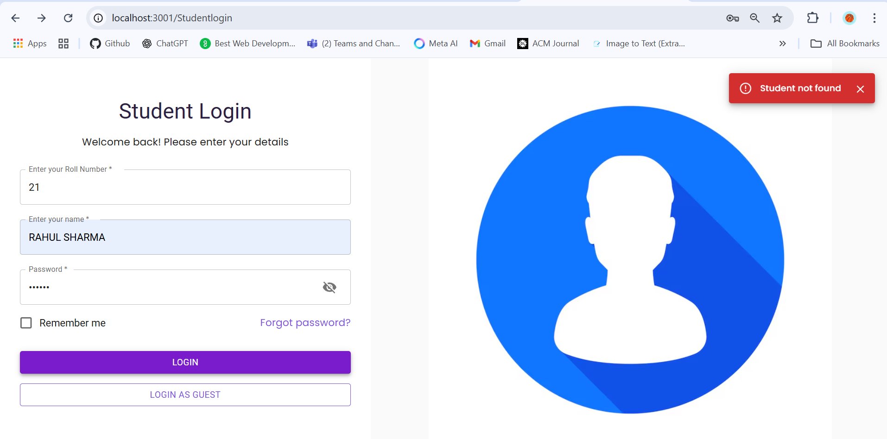
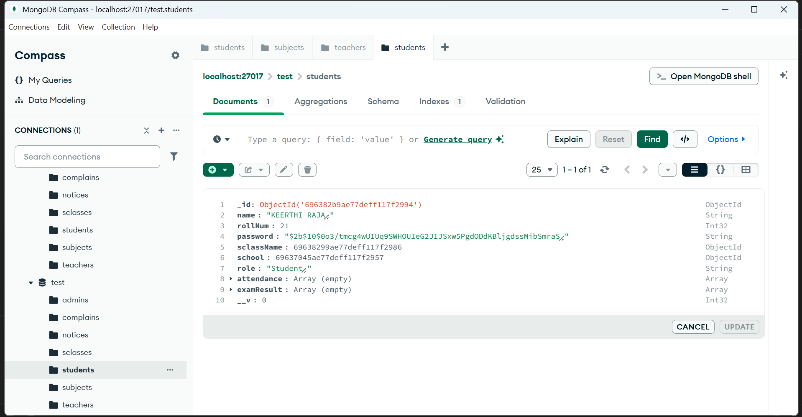

<h1 align="center">
   Student Information Management System
</h1>

<h3 align="center">
<pre>A MERN-based Student Information Management System implementing role-based access (Admin, Teacher, Student) with JWT authentication. The system supports attendance tracking, performance evaluation, and secure REST APIs.</pre>
</h3>

## Problem Statement
Educational institutions often manage attendance, academic performance, and student communication using
manual processes or multiple disconnected tools. This results in data inconsistency, limited transparency,
and security risks around sensitive student information.

There is a need for a centralized, secure system that allows administrators, teachers, and students to
interact with academic data based on clearly defined roles and permissions.

## Solution Overview

This project implements a web-based Student Information Management System using the MERN stack
(MongoDB, Express.js, React.js, Node.js).

The system provides role-based access for Admin, Teacher, and Student users, enabling secure management
of attendance, performance evaluation, and communication through RESTful APIs. JWT-based authentication
ensures that users can only access functionality permitted by their role.


## Features
The system is designed to digitize core academic workflows while maintaining security, scalability,
and clear separation of responsibilities between users.
- **User Roles:** The system supports three user roles: Admin, Teacher, and Student. Each role has specific functionalities and access levels.

- **Admin Dashboard:** Administrators can add new students and teachers, create classes and subjects, manage user accounts, and oversee system settings.

- **Attendance Tracking:** Implemented attendance management using REST APIs with MongoDB schemas linked to classes and students.

- **Performance Assessment:** Teachers can assess students' performance by providing marks and feedback. Students can view their marks and track their progress over time.

- **Data Visualization:** Students can visualize their performance data through interactive charts and tables, helping them understand their academic performance at a glance.

- **Communication:** Users can communicate effortlessly through the system. Teachers can send messages to students and vice versa, promoting effective communication and collaboration.

## Technologies Used

- Frontend: React.js, Material UI, Redux
- Backend: Node.js, Express.js
- Database: MongoDB
- Containerization: Docker, Docker Compose (local development)
- Authentication & Security: JWT-based role authentication

<br>

## Architecture Overview
- React frontend communicates with Express REST APIs using the Fetch API
- JWT tokens are used for authentication and role-based authorization
- MongoDB stores users, classes, attendance, and performance data

## Design Decisions & Trade-offs

### JWT Authentication vs Session-based Authentication
JWT was chosen to keep the backend stateless and scalable, especially for a REST API-driven architecture.
The trade-off is that token revocation is less straightforward and requires careful expiration handling.

### MongoDB vs Relational Database
MongoDB was selected for its flexible schema design, which simplifies modeling evolving entities such as
attendance records and performance data. This comes at the cost of weaker enforced relationships compared
to a relational database.

### MERN Stack vs Monolithic Framework
Using a separate React frontend and Express backend improves modularity and mirrors real-world production
systems, but increases initial setup complexity and API management overhead.

### Dockerized Development Environment
Docker and Docker Compose were used to ensure consistent local environments and easier onboarding.
This adds some learning curve and slightly slower startup times compared to a non-containerized setup.


## Installation

Open 2 terminals in separate windows/tabs.

Terminal 1: Setting Up Backend 
```sh
cd backend
npm install
npm start
```

Create a file called .env in the backend folder.
Inside it write this :

```sh
MONGO_URL = mongodb://localhost:27017/Student_Record
```
If you are using MongoDB Compass you can use this database link but if you are using MongoDB Atlas then instead of this link write your own database link.

Terminal 2: Setting Up Frontend
```sh
cd frontend
npm install
npm start
```
Now, navigate to `localhost:3000` in your browser. 
The Backend API will be running at `localhost:5000`.

You can run the project locally using **Docker** for a fully containerized environment.

1. **Clone the repository**:

```sh
git clone <your-repo-link>
cd MERN-Student-Information-Management-System
```

## Project Structure

```
.
├── backend/                  # Node.js + Express API
│   ├── Dockerfile            # Backend Dockerfile
│   └── ...                   # Server files
├── frontend/                 # React.js frontend
│   ├── Dockerfile            # Frontend Dockerfile
│   └── ...                   # Client files
├── docker-compose.yml        # Used for local multi-container orchestration
└── .env                      # Environment variables (e.g., MONGODB_URI)
```

## Future Improvements
- Add analytics dashboards for administrators
- Deploy the system on a cloud platform with CI/CD


## Screenshots

### User Role


### Home-page


### Login API (JWT Token Generated)


### Protected Route Access


### Application Dashboard


### Student-Addition


### Attendance feature


### Login-page


### Database (MongoDB)



